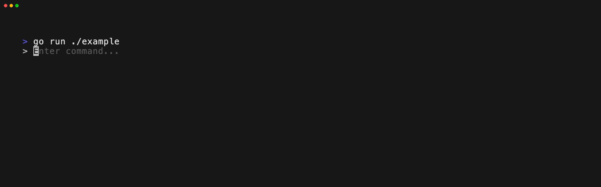

# Bubblecomplete

Bubblecomplete is a command suggestion and autocompletion component for [Bubble Tea](https://github.com/charmbracelet/bubbletea) applications.



## Installing

First use `go get` to install the latest version of the library.

```shell
go get -u github.com/dotopototo/bubblecomplete
```

Or alternatively, to get a specific branch:

```shell
go get -u github.com/dotopototo/bubblecomplete@beta
```

Next include bubblecomplete in your application.

```go
import "github.com/dotopototo/bubblecomplete"
```

## Usage

See the [example](./example/main.go) for a full working implementation.

The command structure expects the following:

```
command [subcommands] [flags] [positionalArguments]
```

- A command has **either** subcommands **or** positional arguments — never both.
  > `git stash` has subcommands (`pop`, `apply`, `drop`, …); `git push` has positional arguments (`origin main`).
- Subcommands can be nested arbitrarily deep.
  > `git stash pop` is a subcommand of `stash`, which is a subcommand of `git`.
- Any command or subcommand can also have flags, in any combination with positional arguments.
  > `cat file.txt -n` has both a positional argument and a flag.
- The order of positional arguments matters.
  > `cp file.txt destination` is not the same as `cp destination file.txt`.
- Flags marked `Persistent: true` are inherited by every subcommand of the command they're declared on.
  > A `--help` flag on `git` is also available as `git stash --help`.

These rules are enforced by `Command.Validate()`, which `New` calls on every supplied command. Building a `Model` with conflicting subcommands and positional arguments, duplicate flag aliases, or invalid argument types returns an error.

#### Setup

Create a slice of `bubblecomplete.Command` structs to represent the available commands, with `bubblecomplete.PositionalArgument` structs for any required arguments and `bubblecomplete.Flag` structs for any flags that can be passed.

```go
var commands = []*bubblecomplete.Command{
	{
		Command:     "cp",
		Description: "Copy files and directories",
		PositionalArguments: []*bubblecomplete.PositionalArgument{
			{
				Name:        "file",
				Description: "File to copy",
				Type:        bubblecomplete.FileDirArgument,
				Required:    true,
			},
			{
				Name:        "destination",
				Description: "Destination to copy the file to",
				Type:        bubblecomplete.DirArgument,
				Required:    true,
			},
		},
		Flags: []*bubblecomplete.Flag{
			{
				ShortFlag:   "-r",
				Description: "Copy directories recursively",
				Type:        bubblecomplete.BoolArgument,
			},
		},
	},
}
```

#### Commands

| Field               | Description                                                                            | Type                                   |
| ------------------- | -------------------------------------------------------------------------------------- | -------------------------------------- |
| Command             | The command name                                                                       | `string`                               |
| Description         | A description of the command                                                           | `string`                               |
| SubCommands         | A slice of `bubblecomplete.Command` structs representing subcommands                   | `[]*bubblecomplete.Command`            |
| PositionalArguments | A slice of `bubblecomplete.PositionalArgument` structs representing required arguments | `[]*bubblecomplete.PositionalArgument` |
| Flags               | A slice of `bubblecomplete.Flag` structs representing flags                            | `[]*bubblecomplete.Flag`               |

#### Positional Arguments

| Field       | Description                      | Type                          |
| ----------- | -------------------------------- | ----------------------------- |
| Name        | The argument name                | `string`                      |
| Description | A description of the argument    | `string`                      |
| Type        | The type of the argument         | `bubblecomplete.ArgumentType` |
| Required    | Whether the argument is required | `bool`                        |

#### Flags

| Field       | Description                                                                        | Type                          |
| ----------- | ---------------------------------------------------------------------------------- | ----------------------------- |
| ShortFlag   | Single-ASCII-letter short flag, e.g. `-v`. Use a long or PowerShell flag for non-letter names. | `string` |
| LongFlag    | The long flag identifier i.e. `--verbose`                                          | `string`                      |
| PsFlag      | PowerShell-style flag, e.g. `-Verbose` (two or more characters; mutually exclusive with ShortFlag and LongFlag on the same Flag) | `string` |
| Description | A description of the flag                                                          | `string`                      |
| Type        | The type of argument the flag expects                                              | `bubblecomplete.ArgumentType` |
| Persistent  | A persistent flag is available to all subcommands of the command                   | `bool`                        |

#### Argument Types

| Type            | Description                                                                        |
| --------------- | ---------------------------------------------------------------------------------- |
| StringArgument  | A string argument that can be set to any value                                     |
| IntArgument     | An integer argument that can be set to any integer value                           |
| FloatArgument   | A float argument that can be set to any float value                                |
| BoolArgument    | A boolean argument that can be set to `true` or `false` (or left empty for `true`) |
| FileArgument    | A file argument that can be set to a valid file path                               |
| DirArgument     | A directory argument that can be set to a valid directory path                     |
| FileDirArgument | A file or directory argument that can be set to a valid file or directory path     |

Create a `bubblecomplete.Model` struct with the commands and set any options you want to set, and assign it to your bubbletea program model.

```go
type model struct {
	bubblecomplete bubblecomplete.Model
}

func createModel() tea.Model {
	bc, err := bubblecomplete.New(commands, 100,
		bubblecomplete.WithHistoryLimit(50),
		bubblecomplete.WithIcons(true),
	)
	if err != nil {
		panic(err)
	}

	m := model{
		bubblecomplete: bc,
	}

	return m
}

func (m model) View() tea.View {
  return m.bubblecomplete.View()
}
```

When composing Bubblecomplete with other content, use `Render()` to get the
component's output as a string:

```go
func (m model) View() tea.View {
  return tea.NewView("Header\n" + m.bubblecomplete.Render())
}
```

## Options

Each option below is a public field on `Model` and also has a `With*`
construction option (for example `WithCompletionRows(5)` or
`WithDescriptions(false)`). Use whichever style fits.

#### General

| Option              | Description                                                                              | Default         |
| ------------------- | ---------------------------------------------------------------------------------------- | --------------- |
| Autotrim            | Trim extra whitespace from the ends of the input                                         | `true`          |
| CompletionsOffset   | The left margin offset of the completion list                                            | `0`             |
| CompletionsPosition | The position of the completion list relative to the input                                | `PositionBelow` |
| CompletionRows      | The number of rows to show in the completion list before scrolling                       | `5`             |
| HistoryFilePath     | The path to a `.json` file to store the command history for persistence between sessions | -               |
| HistoryLimit        | The maximum number of history entries to store and save                                  | `100`           |
| IndentCompletions   | Indent the completion list to match the current input length                             | `true`          |
| ShowBorderScroll    | Show different border colors around the completion list to indicate scrolling            | `false`         |
| ShowScrollbar       | Show a vertical scrollbar to indicate scrolling                                          | `false`         |
| ShowDescriptions    | Render the description column next to each completion name                               | `true`          |

#### Icons

| Option       | Description                        | Default |
| ------------ | ---------------------------------- | ------- |
| ShowIcons    | Show type indicator icons          | `false` |
| CommandIcon  | Icon for command completions       | `›`     |
| ArgumentIcon | Icon for argument completions      | `◆`     |
| FlagIcon     | Icon for flag completions          | `◇`     |

#### Styles

Styles are grouped on a `Styles` struct accessed via `Styles()` / `SetStyles()`:

```go
s := bc.Styles()
s.Input.Valid = lipgloss.NewStyle().Foreground(lipgloss.Color("10"))
s.Completion.Match = lipgloss.NewStyle().Bold(true)
bc.SetStyles(s)
```

| Field                    | Description                                          | Default           |
| ------------------------ | ---------------------------------------------------- | ----------------- |
| Input.Valid              | Style for valid user input                           | (green)           |
| Input.Invalid            | Style for invalid user input                         | (muted text)      |
| Completion.Match         | Style for the matched prefix in completions          | (bold pink)       |
| Completion.SelectedRow   | Style for the selected completion row                | (bold, highlight) |
| Completion.Row           | Style for odd completion rows                        | (subtle bg)       |
| Completion.AltRow        | Style for even completion rows                       | (alt subtle bg)   |
| Completion.Border        | Style for the completions border                     | (rounded border)  |
| Completion.Description   | Style for completion descriptions                    | (muted)           |
| Completion.Icon          | Style for type indicator icons                       | (pink)            |
| Scrollbar.Thumb          | Style for the scrollbar thumb                        | (pink)            |
| Scrollbar.Track          | Style for the scrollbar track                        | (border color)    |

#### Key Bindings

Bindings are exposed via `KeyMap()` / `SetKeyMap()`:

```go
import "charm.land/bubbles/v2/key"

k := bc.KeyMap()
k.Submit = key.NewBinding(key.WithKeys("enter", "ctrl+s"))
bc.SetKeyMap(k)
```

| Field            | Description                                | Default              |
| ---------------- | ------------------------------------------ | -------------------- |
| NextCompletion   | Cycle forward through completions          | `tab`, `ctrl+n`      |
| PrevCompletion   | Cycle backward through completions         | `shift+tab`, `ctrl+p`|
| AcceptCompletion | Accept the selected or inline completion   | `right`, `ctrl+e`    |
| Submit           | Submit the current input                   | `enter`              |
| HistoryPrev      | Walk back through command history          | `up`                 |
| HistoryNext      | Walk forward through command history       | `down`               |

### History

- The newest command is at `History[0]`. Trimming keeps the newest `HistoryLimit` entries.
- A `HistoryLimit` of zero or less disables history entirely.
- Adjacent duplicates are suppressed: pressing enter twice on the same input only stores one entry.
- Invalid commands are stored — history is "what the user submitted," not "what validated."
- `WithHistoryFilePath(path)` (or `SetHistoryFilePath`) loads history from a JSON file on startup and saves atomically on each submit. Errors during load or save surface via `Model.Error()`.

### Filesystem Argument Validation

`FileArgument`, `DirArgument`, and `FileDirArgument` validate the value against the real filesystem using `os.Stat`. Paths are resolved relative to the process's working directory. Quoted strings are unquoted before the stat check, so `cat "my file.txt"` works as long as the file actually exists. A configurable working-directory / filesystem abstraction is on the roadmap.

## Roadmap

- [x] Update to bubbletea v2
- [x] Support PowerShell style flags
- [ ] Support PowerShell aliases for flags i.e. `-v` for `-Verbose`
- [ ] Autocomplete for filepaths
  - [ ] Underlined white if part of a valid path
  - [ ] Green if full valid path
  - [ ] Red if invalid path
- [ ] Option to have flags disable other flags if they're mutually exclusive
- [x] Improved documentation comments for public functions and structs
- [x] Wider range of tests for more critical functions, for improved maintainability
- [x] Option to not show the descriptions of the commands, flags etc
- [x] More exposed color options for the completion list, scrolling etc

## Non-Goals

Some behaviors are intentionally out of scope. Don't expect:

- Full POSIX shell parsing (e.g., command substitution, here-docs, redirections)
- Executing commands — Bubblecomplete only reports the submitted string back to the host via `SelectedCommandMsg`
- Shell alias resolution
- Environment variable expansion (`$HOME`, `${FOO}`)
- Glob expansion (`*.go`)
- Command-specific dynamic completions — until a provider API lands in Part 4

If you need any of these, do them in the host application after receiving the submitted command.

## FAQ

### Colors

Bubblecomplete (and Bubble Tea applications in general) work best with a terminal that supports 24-bit color. If you're using a terminal that doesn't support 24-bit color, you may see some odd colors. If you're using a terminal that supports 24-bit color, ensure that it's enabled in your terminal emulator, tmux config (if you're using tmux) etc and that your `$TERM` environment variable is set to a value that supports 24-bit color (such as `xterm-256color`) and your `$COLORTERM` environment variable is set to `truecolor`.

### Concurrency

`Model` is not goroutine-safe. This is intentional: Bubble Tea runs `Update` on a single goroutine, and all model state changes should happen there. Background work should return `tea.Msg` values that the next `Update` consumes; never mutate `Model` from another goroutine.
