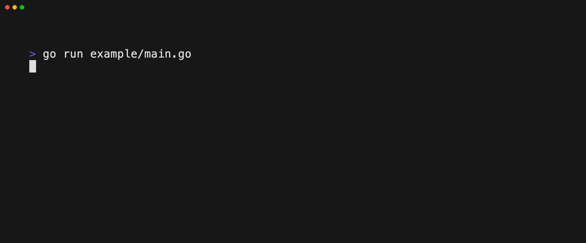

# Bubblecomplete

Bubblecomplete is a command suggestion and autocompletion component for [Bubble Tea](https://github.com/charmbracelet/bubbletea) applications.



## Usage

See the [example](./example/main.go) for a full working implementation.

The command structure expects the following:

```
command [subcommands] [flags] [positionalArguments]
```

- A command can have multiple subcommands or positional arguments, and flags
  > Git can have multiple sub commands such as `git commit`, `git stash` and `git status`
- A command can have subcommands _or_ positional arguments, but not both.
  > i.e. the subcommand `stash` in `git stash` has more subcommands like `git stash pop`, `git stash apply`, etc. but the subcommand `push` in `git push` has positional arguments like `git push origin main`
- Any command or subcommand can have flags.
  > Git can have a flag such as `--version` or a subcommand such as `git commit -m "message"`
- Any command or subcommand can have both positional arguments and flags.
  > Cat expects the positional argument for the file and then flags `cat file.txt -n`
- The order of positional arguments is important
  > `cp file.txt destination` is different from `cp destination file.txt`

#### Setup

Create a slice of `bubblecomplete.Command` structs to represent the available commands, with `bubblecomplete.PositionalArgument` structs for any required arguments and `bubblecomplete.Flag` structs for any flags that can be passed.

```go
var commands = []*bubblecomplete.Command{
	{
		Command:     "cp",
		Description: "Copy files and directories",
		PositionalArguments: []*bubblecomplete.PositionalArgument{
			{
				Name:        "file",
				Description: "File to copy",
				Type:        bubblecomplete.FileDirArgument,
				Required:    true,
			},
			{
				Name:        "destination",
				Description: "Destination to copy the file to",
				Type:        bubblecomplete.DirArgument,
				Required:    true,
			},
		},
		Flags: []*bubblecomplete.Flag{
			{
				ShortFlag:   "-r",
				Description: "Copy directories recursively",
				Type:        bubblecomplete.BoolArgument,
			},
		},
	},
}
```

#### Commands

| Field               | Description                                                                            | Type                                   |
| ------------------- | -------------------------------------------------------------------------------------- | -------------------------------------- |
| Command             | The command name                                                                       | `string`                               |
| Description         | A description of the command                                                           | `string`                               |
| Subcommands         | A slice of `bubblecomplete.Command` structs representing subcommands                   | `[]*bubblecomplete.Command`            |
| PositionalArguments | A slice of `bubblecomplete.PositionalArgument` structs representing required arguments | `[]*bubblecomplete.PositionalArgument` |
| Flags               | A slice of `bubblecomplete.Flag` structs representing flags                            | `[]*bubblecomplete.Flag`               |

#### Positional Arguments

| Field       | Description                      | Type                          |
| ----------- | -------------------------------- | ----------------------------- |
| Name        | The argument name                | `string`                      |
| Description | A description of the argument    | `string`                      |
| Type        | The type of the argument         | `bubblecomplete.argumentType` |
| Required    | Whether the argument is required | `bool`                        |

#### Flags

| Field       | Description                                                      | Type                          |
| ----------- | ---------------------------------------------------------------- | ----------------------------- |
| ShortFlag   | The short flag identifier i.e. `-v`                              | `string`                      |
| LongFlag    | The long flag identifier i.e. `--verbose`                        | `string`                      |
| Description | A description of the flag                                        | `string`                      |
| Type        | The type of argument the flag expects                            | `bubblecomplete.argumentType` |
| Persistent  | A persistent flag is available to all subcommands of the command | `bool`                        |

#### Argument Types

| Type            | Description                                                                        |
| --------------- | ---------------------------------------------------------------------------------- |
| StringArgument  | A string argument that can be set to any value                                     |
| IntArgument     | An integer argument that can be set to any integer value                           |
| FloatArgument   | A float argument that can be set to any float value                                |
| BoolArgument    | A boolean argument that can be set to `true` or `false` (or left empty for `true`) |
| FileArgument    | A file argument that can be set to a valid file path                               |
| DirArgument     | A directory argument that can be set to a valid directory path                     |
| FileDirArgument | A file or directory argument that can be set to a valid file or directory path     |

Create a `bubblecomplete.Model` struct with the commands and set any options you want to set, and assign it to your bubbletea program model.

```go
type model struct {
	bubblecomplete bubblecomplete.Model
}

func createModel() tea.Model {
	bc := bubblecomplete.New(commands, 100)
  bc.HistoryLimit = 50

  m := model{
    bubblecomplete: ac,
  }

	return m
}

func (m model) View() string {
  return m.bubblecomplete.View()
}
```

## Options

| Option              | Description                                                                              | Default         |
| ------------------- | ---------------------------------------------------------------------------------------- | --------------- |
| Autotrim            | Trim extra whitespace from the ends of the input                                         | `true`          |
| CompletionsAbove    | Show the completion list above the input instead of below                                | `false`         |
| CompletionsOffset   | The left margin offset of the completion list                                            | `0`             |
| CompletionsPosition | The position of the completion list relative to the input                                | `PositionBelow` |
| CompletionRows      | The number of rows to show in the completion list before scrolling                       | `5`             |
| HistoryFilePath     | The path to a `.json` file to store the command history for persistance between sessions | -               |
| HistoryLimit        | The maximum number of history entries to store and save                                  | `100`           |
| IndentCompletions   | Indent the completion list to match the current input length                             | `true`          |
| InvalidCommandStyle | Lipgloss style for invalid user input                                                    | (white/black)   |
| ShowBorderScroll    | Show different border colors around the completion list to indicate scrolling            | `true`          |
| ShowScrollbar       | Show a horizontal scrollbar to indicate scrolling                                        | `false`         |
| ValidCommandStyle   | Lipgloss style for valid user input                                                      | (green)         |

## Roadmap

- [ ] Update to bubbletea v2
- [ ] Autocomplete for filepaths
  - [ ] Underlined white if part of a valid path
  - [ ] Green if full valid path
  - [ ] Red if invalid path
- [ ] Option to have flags disable other flags if they're mutually exclusive
- [ ] Improved documentation comments for public functions and structs
- [ ] Wider range of tests for more critical functions, for improved maintainability
- [ ] Option to not show the descriptions of the commands, flags etc
- [ ] More exposed color options for the completion list, scrolling etc

## FAQ

### Colors

Bubblecomplete (and Bubble Tea applications in general) work best with a terminal that supports 24-bit color. If you're using a terminal that doesn't support 24-bit color, you may see some odd colors. If you're using a terminal that supports 24-bit color, ensure that it's enabled in your terminal emulator, tmux config (if you're using tmux) etc and that your `$TERM` environment variable is set to a value that supports 24-bit color (such as `xterm-256color`) and your `$COLORTERM` environment variable is set to `truecolor`.
